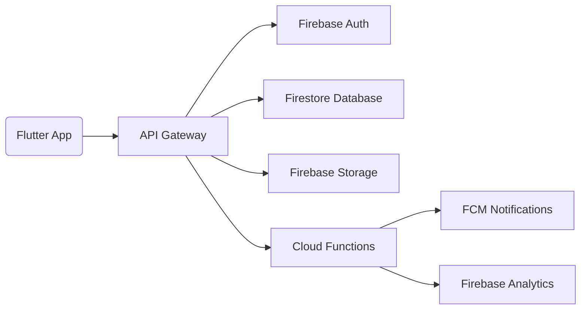

<!--
  README.md for RevoLOL – The Meme Battle Arena
  Fully interactive, animated, feature-rich GitHub-native presentation.
-->

<h1 align="center">
  🎉 RevoLOL – The Meme Battle Arena
</h1>

<p align="center">
  
</p>

<p align="center">
  <a href="https://github.com/yourusername/revolol-app/stargazers">
    
  </a>
  <a href="https://github.com/yourusername/revolol-app/network/members">
    
  </a>
  <a href="https://github.com/yourusername/revolol-app/actions">
    
  </a>
  <a href="https://github.com/yourusername/revolol-app/issues">
    
  </a>
  <a href="https://github.com/yourusername/revolol-app/blob/main/LICENSE">
    
  </a>
</p>

---

## 🚀 Introduction

**RevoLOL** is a revolutionary mobile application built with **Flutter** that brings the excitement of **meme creation**, **social sharing**, and **competitive gaming** into one cohesive platform. Designed for students, gamers, creators, and meme aficionados worldwide, RevoLOL injects **fun**, **friendly rivalry**, and **global recognition** into every scroll.

> “Imagine **Instagram Reels** meets **Reddit**, powered by the competitive spirit of **Clash Royale** — all in an app devoted solely to memes.”  

---

## 📈 Table of Contents

<details>
<summary>Jump to section</summary>

1. [Vision & Mission](#vision--mission)  
2. [Core Philosophy](#core-philosophy)  
3. [Feature Overview](#feature-overview)  
4. [Interactive Demo (Mock GIFs)](#interactive-demo-mock-gifs)  
5. [Tech Stack & Architecture](#tech-stack--architecture)  
6. [MVP Status & Roadmap](#mvp-status--roadmap)  
7. [Monetization Strategy](#monetization-strategy)  
8. [Community & Contribution](#community--contribution)  
9. [Getting Started](#getting-started)  
10. [Roadmap Milestones](#roadmap-milestones)  
11. [FAQ](#faq)  
12. [License & Acknowledgments](#license--acknowledgments)

</details>

---

## 🔭 Vision & Mission

| 🎯 Goal        | Description                                                                 |
|----------------|-----------------------------------------------------------------------------|
| **Vision**     | Become the **global hub** for meme battles, community laughter, and rewards. |
| **Mission**    | Empower creators to craft, compete, and conquer with memes.                  |
| **Values**     | **Creativity**, **Fair Play**, **Community**, **Innovation**.                |

---

## 🧠 Core Philosophy

> **“Competition makes every meme count.”**

- **User-Centric**: Seamless, engaging UX with instant feedback loops.  
- **Community-Driven**: Transparent voting, leaderboards, and creator rewards.  
- **Gamified**: Earn coins, badges, and titles through daily challenges.  
- **Open-Source Energy**: Contributors shape the platform’s evolution.

---

## ⚙️ Feature Overview

```txt
[ Upload & Create ]
  • Meme templates, filters, and AI styling
  • Short video reels (up to 30s)
  • Tagging & categorization (genres, trends)

[ Battle Mode ]
  • Daily, Weekly, Monthly tournaments
  • Randomized matchups for fairness
  • Real-time voting with cooldowns

[ RevoBoard ]
  • Global & local leaderboards
  • Tiered ranking (Bronze → Diamond)
  • Creator badges & streak rewards

[ Social & Engagement ]
  • Like, comment, and share
  • Follow creators and themes
  • Private Battle Rooms with friends

[ Notifications & Alerts ]
  • Battle invites
  • Vote reminders
  • Reward announcements
```

<details>
<summary>Show Detailed Feature Matrix</summary>

| Feature                     | Description                                                   | Status        |
|-----------------------------|---------------------------------------------------------------|---------------|
| Meme Feed                   | Infinite scroll, filters, and personalized recommendations    | 🔧 In Progress |
| Battle Creation             | Auto-bracket generation and timer-based voting                | 🧠 Planning    |
| Real-Time Voting            | Anonymous & anti-bias modes                                   | 🧠 Planning    |
| Leaderboard Engine          | Daily/weekly/monthly/all-time ranking                         | ✅ Prototype   |
| Push Notifications          | Battle start/end, follower posts, reward claim alerts         | 🔜 Upcoming   |
| Creator Profiles            | Upload history, badges, follower count                        | 🔜 Upcoming   |
| Coin Economy                | Earn through participation, spend on boosts & features        | 🧠 Planning    |
| Brand Challenges            | Sponsored tournaments with prizes                            | 🧠 Planning    |
| Admin Panel                 | Content moderation, analytics, feature toggles                | 🔧 In Progress |

</details>

---

## 🎨 Interactive Demo (Mock GIFs)

> *Note: These are illustrative placeholders. Live prototypes coming soon!*

<div align="center">

<details>
<summary>👾 Scroll through RevoLOL Feed (GIF)</summary>

```html
<video autoplay loop muted playsinline style="max-width:100%; border-radius:8px;">
  <source src="https://media.giphy.com/media/3oKIPsx2VAYAgEHC12/giphy.mp4" type="video/mp4">
</video>
```

</details>

<details>
<summary>⚔️ Meme Battle in Action (GIF)</summary>

```html
<video autoplay loop muted playsinline style="max-width:100%; border-radius:8px;">
  <source src="https://media.giphy.com/media/l46Cy1rHbQ92uuLXa/giphy.mp4" type="video/mp4">
</video>
```

</details>

</div>

---

## 🛠️ Tech Stack & Architecture



- **Frontend**: Flutter + Dart (iOS & Android)  
- **Backend**: Firebase (Auth, Firestore, Cloud Functions)  
- **Storage**: Firebase Storage for media content  
- **CI/CD**: GitHub Actions → Fastlane deploy  
- **Monitoring**: Crashlytics, Performance Monitoring  

---

## 📆 MVP Status & Roadmap

| Phase         | Timeline      | Deliverables                                          |
|---------------|---------------|-------------------------------------------------------|
| **Phase 1**   | Weeks 1–2     | Setup environment, core Flutter project scaffold      |
| **Phase 2**   | Weeks 3–4     | Meme upload & feed, basic UI components               |
| **Phase 3**   | Weeks 5–6     | Battle logic, voting system, leaderboard integration  |
| **Phase 4**   | Weeks 7–8     | Notifications, profiles, initial monetization hooks   |
| **Phase 5**   | Weeks 9–12    | Beta testing, bug fixes, performance optimization     |

---

## 💸 Monetization Strategy

- **In-Feed Ads (AdMob)**: Non-intrusive banners & interstitials  
- **Coin Economy**: Earn coins through participation, spend on boosts  
- **Premium Creator Tools**: Advanced analytics, scheduling, custom frames  
- **Brand Sponsorships**: Hosted meme contests with real-world prizes  

---

## 🌐 SEO & Discoverability

> Optimized keywords: **meme battle arena**, **meme competition app**, **social meme platform**, **gaming memes**, **student meme community**, **Gen Z social app**.

- Repository name: `revolol-app`  
- GitHub Topics: `flutter`, `meme`, `social`, `battle`, `gaming`  
- Rich meta in README front matter  

---

## 🤝 Community & Contribution

<div align="center">
  <a href="https://github.com/yourusername/revolol-app/graphs/contributors">
    
  </a>
  <a href="https://github.com/yourusername/revolol-app/issues?q=is%3Aissue+is%3Aopen+label%3A%22good+first+issue%22">
    
  </a>
</div>

Contributions welcome! Check our issue templates & contribution guidelines.

---

## 📝 Getting Started

<details>
<summary>Setup Instructions</summary>

```bash
# Clone the repo
git clone https://github.com/yourusername/revolol-app.git
cd revolol-app

# Install dependencies
flutter pub get

# Configure Firebase (copy env.sample.dart to env.dart and fill values)

# Run the app
flutter run
```

</details>

---

## 🚩 Roadmap Milestones

1. Complete MVP & launch beta on Play Store  
2. Implement premium coin system & in-app purchases  
3. Expand to iOS App Store  
4. Reach 10K MAU  
5. Secure brand partnerships  
6. Open API for plugins & themes  

---

## ❓ FAQ

<details>
<summary>Is this open source?</summary>
Yes, MIT License.
</details>

<details>
<summary>How to suggest a feature?</summary>
Open an issue labeled “enhancement” or discuss on Discord.
</details>

<details>
<summary>Where to find design assets?</summary>
Check the `/docs` folder for mockups and Figma links.
</details>

---

## 📜 License

MIT License © 2025 yourusername

Permission is hereby granted, free of charge, to any person obtaining a copy...
